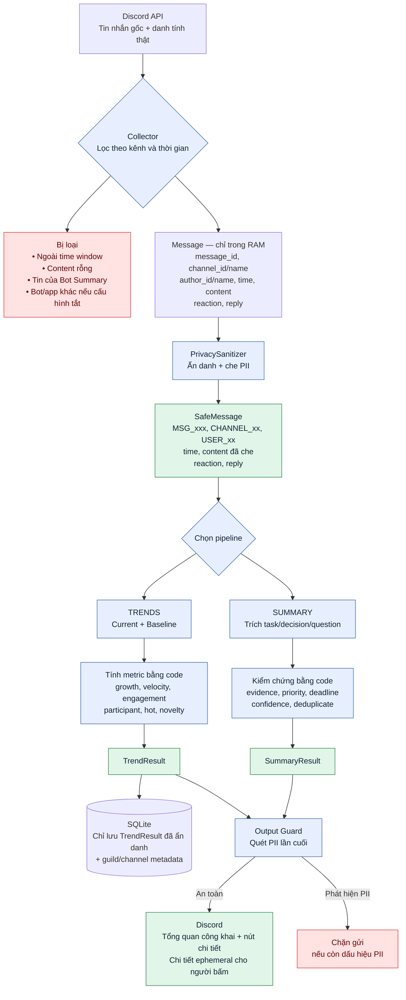
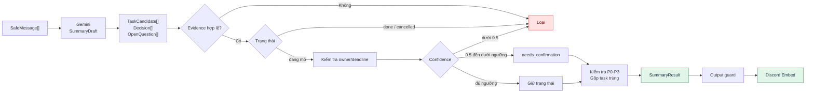
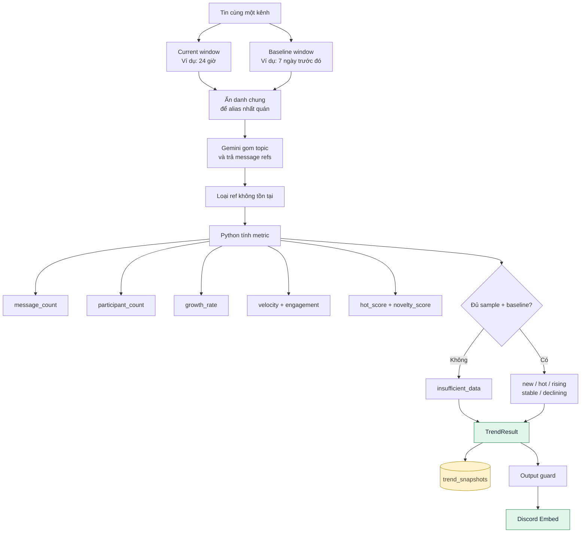
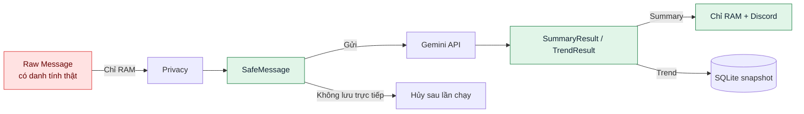

# Sơ đồ luồng dữ liệu

Tài liệu này mô tả dữ liệu đi từ Discord đến báo cáo cuối cùng, trường nào được giữ lại, trường nào bị thay thế và dữ liệu nào được lưu.

## 1. Toàn cảnh



## 2. Dữ liệu thay đổi như thế nào

| Giai đoạn | Dữ liệu đang có | Bị loại hoặc thay thế | Đi tiếp đến đâu |
|---|---|---|---|
| Discord API | ID thật, tên kênh, tên/ID tác giả, thời gian, content, reaction, reply | Chưa thay đổi | `collector.py` |
| Collector | Tạo đối tượng `Message` | Bỏ tin ngoài thời gian, content rỗng, tin của chính Bot Summary; bot/app khác phụ thuộc `INCLUDE_BOT_MESSAGES` | RAM |
| Privacy | Nhận `Message` còn thông tin thật | `message_id → MSG_001`, `author → USER_01`, `channel → CHANNEL_01`; che email, phone, IP, địa chỉ, URL, secret | `SafeMessage` |
| Gemini input | Chỉ nhận `SafeMessage` | Không nhận ID thật, username/display name hoặc tên kênh thật | Summary hoặc Trends |
| Validation | Nhận bản nháp từ Gemini | Loại ID nguồn bịa, kết luận thiếu nguồn, task hoàn thành/hủy và dữ liệu không đủ tin cậy | Kết quả cuối |
| Output guard | Nhận JSON kết quả đã ẩn danh | Chặn toàn bộ report nếu vẫn phát hiện mẫu PII | Discord Embed |

### Ví dụ trước và sau Privacy

```text
TRƯỚC — Message, chỉ tồn tại trong RAM
{
  message_id: 1550123456789012345,
  channel_id: 1550987654321098765,
  channel_name: "thông-báo-lớp-học",
  author_id: 1550111122223333444,
  author_name: "Nguyễn Văn A",
  created_at: "2026-09-18T05:46:00Z",
  content: "A gửi file cho B, email a@example.com",
  reaction_count: 3,
  reply_count: 1,
  reply_to_id: null
}

SAU — SafeMessage, được phép gửi Gemini
{
  ref: "MSG_001",
  channel_ref: "CHANNEL_01",
  author_ref: "USER_01",
  created_at: "2026-09-18T05:46:00Z",
  content: "USER_01 gửi file cho USER_02, email [EMAIL]",
  reaction_count: 3,
  reply_count: 1,
  reply_to_ref: null
}
```

Bảng ánh xạ giữa ID thật và `USER_xx`/`MSG_xxx` chỉ tồn tại trong bộ nhớ của lần chạy. Nó không được gửi sang Gemini và không được lưu vào SQLite.

## 3. Luồng `/summary`



### SummaryDraft do Gemini trả về

```text
executive_summary
tasks[]
  ├─ title
  ├─ priority: P0 | P1 | P2 | P3
  ├─ status
  ├─ owner_ref
  ├─ deadline
  ├─ reason
  ├─ confidence
  └─ evidence_refs[]
decisions[]
open_questions[]
```

### SummaryResult còn lại sau kiểm chứng

- Task có ít nhất một `evidence_ref` tồn tại.
- Task `done` hoặc `cancelled` đã bị loại.
- Owner không xuất hiện trong nguồn bị đổi thành `null`.
- Deadline không có nguyên văn trong nguồn bị đổi thành `null`.
- Confidence dưới `0.5` bị loại; chưa đạt ngưỡng chính được đưa vào `needs_confirmation`.
- Task gần giống nhau được gộp và sắp theo P0 → P3.
- Chỉ giữ tối đa 16 task, 5 decision và 5 open question.

`SummaryResult` không được lưu vào database; nó chỉ tồn tại trong RAM cho đến khi gửi Discord.

## 4. Luồng `/trends`



### Gemini chỉ tạo bản nháp topic

```text
TopicCandidate
  ├─ topic
  ├─ current_refs[]
  ├─ baseline_refs[]
  ├─ sentiment
  ├─ toxic_refs[]
  └─ explanation
```

### Python tính kết quả định lượng

```text
TopicTrend
  ├─ classification
  ├─ message_count
  ├─ participant_count
  ├─ growth_rate
  ├─ hot_score
  ├─ novelty_score
  ├─ sentiment
  ├─ confidence
  ├─ explanation
  └─ evidence_refs[]
```

Gemini không tự tạo `hot_score` hoặc `growth_rate`. Các giá trị này được tính từ message refs hợp lệ. Nếu phần lớn tin đến từ một tác giả, `hot_score` bị giảm để chống spam tạo trend giả.

## 5. Dữ liệu được gửi, lưu và không lưu



| Loại dữ liệu | Gửi Gemini | Lưu SQLite | Trả về Discord |
|---|---:|---:|---:|
| Raw message có ID/tên thật | Không | Không | Không |
| SafeMessage đã ẩn danh | Có | Không | Không trực tiếp |
| SummaryResult | Không gửi lại | Không | Có |
| TrendResult | Không gửi lại | Có | Có |
| Guild ID và channel ID cấu hình | Không | Có | Không hiển thị trong report |
| Bảng ánh xạ ID thật → alias | Không | Không | Không |

## 6. Những nội dung hiện chưa đi qua pipeline

- Attachment và nội dung file chưa được đọc.
- Text chỉ nằm trong Discord embed chưa được đưa vào `content`.
- Hình ảnh chưa OCR.
- Audio/video chưa được chuyển thành text.
- Reaction chỉ dùng số lượng, chưa phân biệt loại emoji.
- Tin có `content` rỗng vẫn bị bỏ qua, kể cả khi nó có attachment hoặc embed.

Điều này có nghĩa `INCLUDE_BOT_MESSAGES=true` cho phép đọc text do bot/app khác gửi, nhưng chưa giúp đọc các app chỉ gửi Discord embed không có `message.content`.

## 7. Ảnh hưởng của cấu hình

```text
INCLUDE_BOT_MESSAGES=false
  └─ Giữ tin người dùng, bỏ mọi bot/app.

INCLUDE_BOT_MESSAGES=true
  ├─ Giữ tin người dùng.
  ├─ Giữ text từ bot/app khác.
  └─ Vẫn bỏ tin của chính Bot Summary.
```

Các giới hạn khác:

- `SUMMARY_DEFAULT_HOURS`: cửa sổ mặc định của summary.
- `TREND_CURRENT_HOURS`: cửa sổ hiện tại của trends.
- `TREND_BASELINE_DAYS`: số ngày baseline.
- `MAX_MESSAGES_PER_CHANNEL`: số tin tối đa mỗi kênh.
- `MAX_TOTAL_MESSAGES`: số tin tối đa toàn lượt chạy.
- `MAX_INPUT_CHARACTERS`: tổng số ký tự tối đa gửi phân tích.
